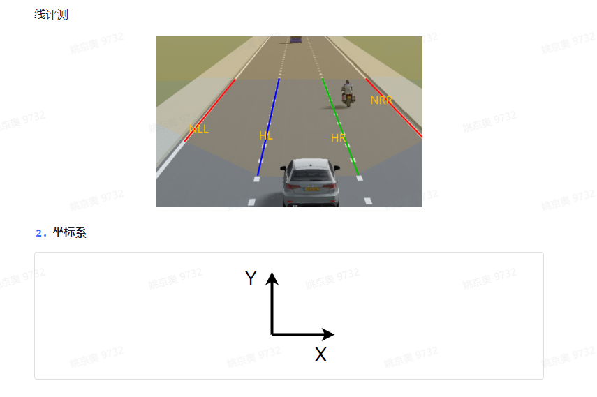
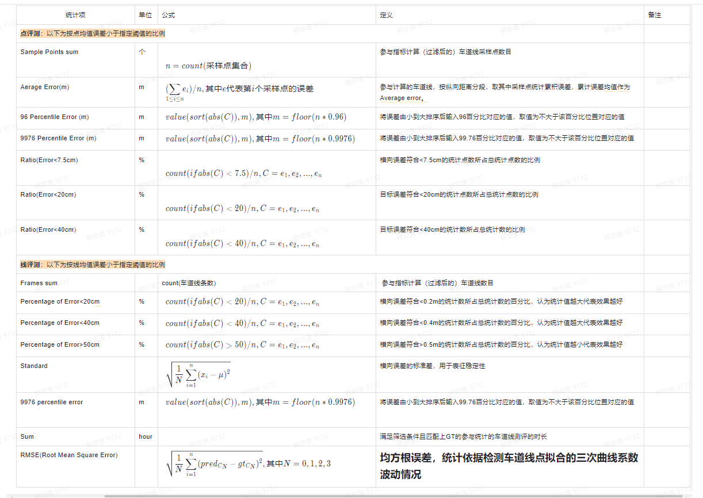

2.2 车道线评测
--------------------------------
.. toctree::
   :maxdepth: 3
   :hidden:

   list02
   list03
   list04

2.2.1 什么是车道线？
~~~~~~~~~~~~~~~~~~~~~~~~~~~~~~~~~
车道线是分隔不同行驶车道的实线或者虚线，通常包含不同的颜色，不同的线型，不同的类型（如道路边沿、合流/分流线等）

2.2.1.1评测逻辑

数据处理流程

1. 真值处理：

当前的真值标注只有表示车道线的点以及该车道线的类别。

    - 双线合并，对于真值的双实线、双虚线、左虚右实、左实右虚，取双线的两个起始点，取其中距离车辆最近的线作为双线代表。

    - 分段合并，对于前虚后实或者其他分段的线，如果一条线的终止点与另一条线的起始点在一定范围内，将这两条线的点合并，取离车最近车道线的类别作为合并后线的代表。道路边缘线不与车道线合并。

    - 线过滤，对于前视车道线感知的评测取[0,150]范围内的点，对于后视车道线感知的评测取[-150,0]范围内的点。然后对每条线在纵轴为整型的位置处进行插值，也就是每隔1m插值一次，获取每条线插值后的点。

    - 位置划分，预设车道宽度为3.75m，根据每条线起始点或纵轴为0位置的点与车的横向距离，分别取车辆左右各两条车道线及道路边缘线。

    - 时间戳获取，记录每帧真值的时间戳。

2. 预测值处理：

预测结果包含线的起始点、终止点、用于表示三次曲线的4个系数、车道线类别和当前车道线的位置信息。

    - 线过滤，拟合出车道线的三次曲线表示，然后对每条线在纵轴为整型的位置处进行插值，也就是每隔1m插值一次，获取每条线插值后的点。如果是前视感知取[0,150]范围内点，如果是后视感知取[-150,0]范围内的点。

    - 时间戳对齐，设定时间窗口阈值，获取真值时间戳的前后时间窗口内的预测帧，若窗口内有多个预测帧，取最近邻的预测帧，若窗口内无预测帧，则该真值时间戳对应的预测帧设为空。最终确保真值时间戳与预测帧时间戳一对一匹配且预测帧数量小于等于真值帧数量。

    - 匹配线，对于对齐后时间戳同位置的预测线与真值线，如果两条线之间的平均误差小于1.5m，则算作匹配，否则为不匹配。

评测流程

1. 点指标

分成两个表，第一个表是同位置的预测线和真值线不考虑类别是否相同，进行计算，第二个表是同位置的预测线和真值线类别必须相同才能参与计算。取预测线及真值线在纵轴方向0~20米、20～40米、40～60米、60~80米、80~100米、100～150米的点进行评测。计算以下指标均取匹配线进行计算。

    - Match Points：取同位置的预测线和真值线在纵轴交集的区域，计算点的数量。

    - Average error：计算预测线和真值线在在同一纵轴坐标位置的点的横向距离，加和求平均。

    - 99.76% error和96% error：取将所有匹配点的横向距离从小到大进行排序，取对应位置的误差值。

    - Ratio(Error<7.5cm, 20cm, 40cm)：取匹配点横向误差小于设定阈值的点的数量除以所有匹配点的数量。

2. 线指标

分别计算同位置预测线类别以及颜色的精确率和召回率。

类别有：实线、虚线、双实线、双虚线、左虚右实、左实右虚、道路边缘线、锥桶线、其他。

颜色有：白色、黄色_红色_橘色归为一类、蓝色、其他。

精确率计算方式：同位置预测线和真值线类别相同的数量除以该位置预测线的数量。

召回率计算方式：同位置预测线和真值线类别相同的数量除以该位置真值线的数量。

2.2.2 通用评测指标
~~~~~~~~~~~~~~~~~~~~~~~~~~~~~~~~~

针对拟合曲线进行点的评测和线得评测，点评测是依据语义分割模型检测结果拟合得曲线按照1m间距采样得到得点集，计算检测点和真值点距离误差，取预测线及真值线在纵轴方向0~20米、20～50米、50～100米、100～150米的点进行评测；线评测值语义分割模型检测得车道线拟合为一条三次曲线，进行线粒度得评测，主要统计整体性能，无距离分段。

2.2.2.1 指标项：

1. 评测对象：

本版本评测评价目标是自车道左右两条线和自车道左左和右右两条车道线侧（参考下图示例），其中：

HL（host left）：车辆当前行驶车道的左侧车道线

HR（host right）：车辆当前行驶车道的右侧车道线

NLL（neighbour left left）：相对于HL再往左的一条线

NRR（neighbour right  right）：相对于HR再往右的一条线

评测只统计分类正确的线：例如：对于HL，取预测线Host中HL和真值线Host中HL，若都存在且同为DASH，则参与计算。

3. 取点方式介绍：
对于预测线，算法会给出线4个系数及车道线在纵轴方向的起始位置和终止位置。根据预测的4个系数构建车道线的三次曲线表示，以纵轴为0的位置开始（若预测线的起点纵轴位置大于0，则以起点位置开始），在纵轴方向每间隔1米采样一个点，直到终止位置。对于真值线，根据真值点拟合出三次曲线，然后以纵轴为0的位置开始，在纵轴方向每间隔1米采样一个点

4. 距离评测定义：
对于真值线，标注中没有给定车道线相对于车的位置信息。车在原点（0，0）处，取车道线在纵轴为0位置的横坐标信息，该横坐标表示距离车的远近。根据距离车的远近划分出HL、HR、NLL、NRR。若车道线起点位置的纵坐标大于0且小于20米，取该线的起点坐标。若车道线起点位置的纵坐标大于20米，舍弃该车道线

表3 车道线指标项汇总

.. image:: img_3.png

统计项：
说明：C表示统计数据的集合，value(C,x)表示C中第x个数的值，sort(C)表示对C进行从小到大排序，floor(x)表示不大于x的整数，count(C)表示统计集合C中数据的总量，pred代表预测值，gt代表真值

表4 车道线指标统计项汇总

2.2.3 评测场景：
~~~~~~~~~~~~~~~~~~~~~~~~~~~~~~~~~
一维场景：目前定义了4类（白天*高速、白天*城区、夜晚*高速、夜晚*城区）

二维场景：按道路结构（弯道、直道、无车道线）

分距离评测：-10~120m（10米分段距离）